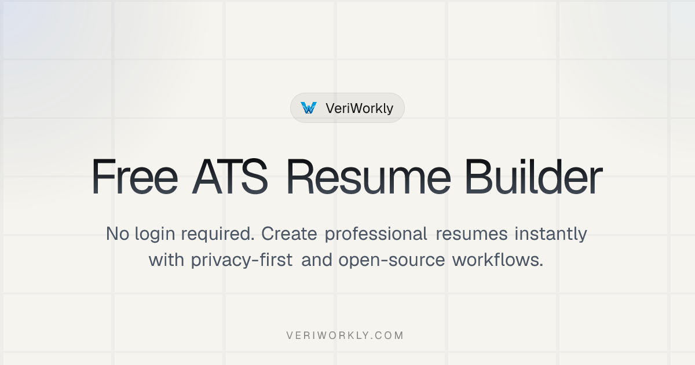
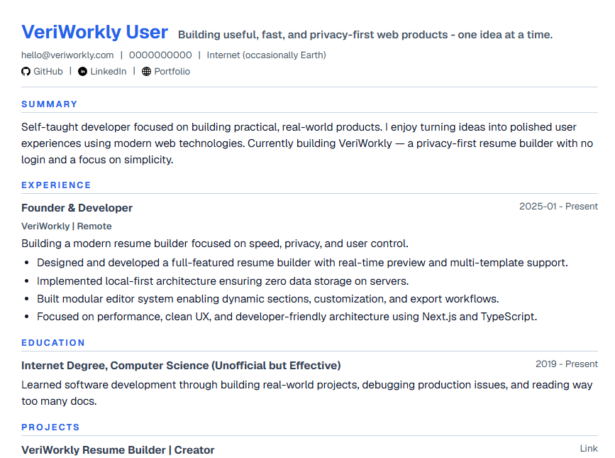

<div align="center">
  <a href="https://veriworkly.com">
    
  </a>

  <h1>VeriWorkly Resume</h1>

  <p><strong>Professional, privacy-centric, and open-source resume engineering platform.</strong></p>

  <p>
    <a href="https://veriworkly.com">Main Application</a>
    ·
    <a href="https://docs.veriworkly.com">Documentation</a>
    ·
    <a href="https://blog.veriworkly.com">Official Blog</a>
    ·
    <a href="https://veriworkly.com/roadmap">Product Roadmap</a>
  </p>

  <p>
    
    
    
  </p>
</div>

---

## Executive Summary

VeriWorkly is a **high-performance, privacy-centric resume building ecosystem** that challenges the traditional SaaS resume builder model. Unlike competitors that require accounts and store sensitive career data on remote servers, VeriWorkly operates on a **Local-First principle**, combining a state-of-the-art Next.js frontend with a robust Node.js/Express backend to provide a seamless, secure, and professional experience.

The platform empowers users to:

- **Build & Edit** professional resumes in real-time with instant visual feedback
- **Export** in multiple formats (ATS-optimized PDF, editable DOCX) with pixel-perfect accuracy
- **Manage** their career data locally without surveillance or tracking
- **Sync** securely to the cloud when they choose to collaborate or access across devices
- **Integrate** with external tools through a fully documented OpenAPI specification

All while maintaining **100% open-source transparency** and enabling self-hosting for enterprises.

## Templates

<table>
  <tr>
    <td align="center">
      
      <br /><sub><b>Compact ATS</b></sub>
    </td>
    <td align="center">
      
      <br /><sub><b>Clean Professional</b></sub>
    </td>
  </tr>
</table>

## Architecture and Technology Stack

VeriWorkly utilizes a modern, type-safe monorepo architecture to ensure service isolation and scalability.

| Component            | Technology                                     |
| :------------------- | :--------------------------------------------- |
| **Frontend**         | Next.js (App Router), React 19, Tailwind CSS 4 |
| **Backend API**      | Node.js, Express                               |
| **Data Persistence** | PostgreSQL (Prisma ORM)                        |
| **Rendering Engine** | react-pdf (Client-side document generation)    |
| **Authentication**   | Better-Auth (Passwordless OTP)                 |
| **State Management** | Zustand (with persistence)                     |

## Repository Structure

The project is organized into independent applications and shared packages:

- **`apps/site`**: The landing page and marketing site.
- **`apps/studio`**: The primary user interface for resume management and building.
- **`apps/server`**: Centralized API service handling auth and sync.
- **`apps/docs-platform`**: Technical and user documentation (powered by Fumadocs).
- **`apps/blog-platform`**: Official product communications and career guides.
- **`packages/ui`**: Shared design system and component library.

## Deployment and Development

Detailed technical documentation is available at [docs.veriworkly.com](https://docs.veriworkly.com).

### Quick Start (Local Development)

1. **Initialize Workspace**:
   ```bash
   npm install
   ```
2. **Environment Configuration**:
   ```bash
   cp .env.example .env
   cp apps/server/.env.example apps/server/.env
   ```
3. **Database Migration**:
   ```bash
   npm run db:push -w @veriworkly/server
   ```
4. **Launch Services**:
   ```bash
   npm run dev
   ```

### Quick Start (Docker)

Deploy the entire ecosystem using our optimized Docker Compose configuration:

```bash
docker compose --env-file .env.docker up -d --build
```

## Documentation Index

| Resource                                                                                | Scope                                        |
| :-------------------------------------------------------------------------------------- | :------------------------------------------- |
| [Technical Documentation](https://docs.veriworkly.com)                                  | Architecture, API Reference, and Deployment. |
| [User Support](https://docs.veriworkly.com/docs/user-guides/creating-your-first-resume) | Guides for building and managing resumes.    |
| [Local Setup Guide](README.Local.md)                                                    | Detailed manual installation instructions.   |
| [Docker Deployment](README.Docker.md)                                                   | Production self-hosting instructions.        |
| [Contributing Guidelines](https://docs.veriworkly.com/docs/contributing/index)          | Standards and protocols for contributors.    |

## Security & Privacy

### Data Protection

- **Local-First**: Resume data stored locally in browser by default
- **Encryption**: All data encrypted in transit (HTTPS) and at rest (database)
- **No Tracking**: Zero analytics or tracking of user behavior
- **Open Source**: Code transparency enables community security audits

### Reporting Vulnerabilities

Please do NOT open GitHub issues for security vulnerabilities. Instead, email info@veriworkly.com with:

- Description of the vulnerability
- Steps to reproduce
- Potential impact assessment

For complete security policy, see [SECURITY.md](SECURITY.md)

## Contributing

VeriWorkly is an open-source project and welcomes community contributions. Please review our [Contributing Guide](https://docs.veriworkly.com/docs/contributing/index) before submitting Pull Requests.

### Ways to Contribute

1. **Code**: Submit bug fixes, features, or performance improvements
2. **Design**: Contribute new resume templates
3. **Documentation**: Improve guides, add examples, fix typos
4. **Translation**: Help localize content to other languages
5. **Feedback**: Report bugs, suggest features on the roadmap
6. **Sponsorship**: Support the project financially

## License

VeriWorkly is released under the **MIT License**. See [LICENSE](LICENSE) file for full details.

## ❤️ Built With Love

VeriWorkly is built by a community of developers passionate about simplifying career building and protecting user privacy. Every line of code reflects our commitment to transparency, security, and user empowerment.

**Made with ❤️ by [VeriWorkly Team](https://veriworkly.com) and [Contributors](https://github.com/Gautam25Raj/veriworkly-resume/graphs/contributors)**
